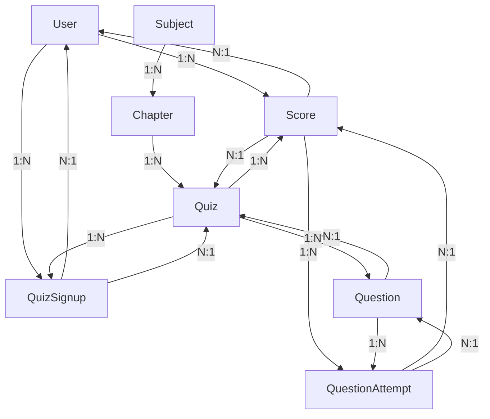

### Database Schema

#### 1. **Users**
Stores details of all users, including the admin.

| Column Name | Data Type | Constraints                                | Index |
| ----------- | --------- | ------------------------------------------ | ----- |
| `id`        | INTEGER   | PRIMARY KEY, AUTOINCREMENT                 |       |
| `username`  | TEXT      | UNIQUE, NOT NULL                           | Yes   |
| `password`  | TEXT      | NOT NULL                                   |       |
| `full_name` | TEXT      | NOT NULL                                   |       |
| `dob`       | DATE      | NULL                                       |       |
| `email`     | TEXT      | UNIQUE, NOT NULL                           | Yes   |
| `role`      | TEXT      | NOT NULL, CHECK(role IN ('admin', 'user')) |       |
| `joined_at` | DATETIME  | NOT NULL, DEFAULT CURRENT_TIMESTAMP        |       |

---

#### 2. **Subjects**
Stores details about subjects created by the admin.

| Column Name   | Data Type | Constraints                         | Index |
| ------------- | --------- | ----------------------------------- | ----- |
| `id`          | INTEGER   | PRIMARY KEY, AUTOINCREMENT          |       |
| `name`        | TEXT      | NOT NULL                            | Yes   |
| `description` | TEXT      | NOT NULL                            |       |
| `created_at`  | DATETIME  | NOT NULL, DEFAULT CURRENT_TIMESTAMP |       |
| `updated_at`  | DATETIME  | NOT NULL, DEFAULT CURRENT_TIMESTAMP |       |

---

#### 3. **Chapters**
Stores details about chapters under subjects.

| Column Name   | Data Type | Constraints                         | Index |
| ------------- | --------- | ----------------------------------- | ----- |
| `id`          | INTEGER   | PRIMARY KEY, AUTOINCREMENT          |       |
| `name`        | TEXT      | NOT NULL                            | Yes   |
| `description` | TEXT      | NULL                                |       |
| `subject_id`  | INTEGER   | FOREIGN KEY REFERENCES Subjects(id) | Yes   |
| `created_at`  | DATETIME  | NOT NULL, DEFAULT CURRENT_TIMESTAMP |       |
| `updated_at`  | DATETIME  | NOT NULL, DEFAULT CURRENT_TIMESTAMP |       |

---

#### 4. **Quizzes**
Stores quiz details linked to chapters.

| Column Name     | Data Type | Constraints                         |
| --------------- | --------- | ----------------------------------- |
| `id`            | INTEGER   | PRIMARY KEY, AUTOINCREMENT          |
| `chapter_id`    | INTEGER   | FOREIGN KEY REFERENCES Chapters(id) |
| `date_of_quiz`  | DATE      | NOT NULL                            |
| `time_duration` | TEXT      | NOT NULL (e.g., '00:30')            |
| `remarks`       | TEXT      | NULL                                |
| `created_at`    | DATETIME  | NOT NULL, DEFAULT CURRENT_TIMESTAMP |
| `updated_at`    | DATETIME  | NOT NULL, DEFAULT CURRENT_TIMESTAMP |

---

#### 5. **Questions**
Stores questions for each quiz.

| Column Name          | Data Type | Constraints                                     |
| -------------------- | --------- | ----------------------------------------------- |
| `id`                 | INTEGER   | PRIMARY KEY, AUTOINCREMENT                      |
| `quiz_id`            | INTEGER   | FOREIGN KEY REFERENCES Quizzes(id)              |
| `question_statement` | TEXT      | NOT NULL                                        |
| `option1`            | TEXT      | NOT NULL                                        |
| `option2`            | TEXT      | NOT NULL                                        |
| `option3`            | TEXT      | NOT NULL                                        |
| `option4`            | TEXT      | NOT NULL                                        |
| `correct_option`     | INTEGER   | NOT NULL, CHECK(correct_option IN (1, 2, 3, 4)) |
| `points`             | INTEGER   | DEFAULT 1                                       |

---

#### 6. **Scores**
Stores user quiz scores.

| Column Name   | Data Type | Constraints                        |
| ------------- | --------- | ---------------------------------- |
| `id`          | INTEGER   | PRIMARY KEY, AUTOINCREMENT         |
| `quiz_id`     | INTEGER   | FOREIGN KEY REFERENCES Quizzes(id) |
| `user_id`     | INTEGER   | FOREIGN KEY REFERENCES Users(id)   |
| `time_stamp`  | DATETIME  | DEFAULT CURRENT_TIMESTAMP          |
| `total_score` | INTEGER   | NOT NULL                           |

---

#### 7. **QuizSignups**
Tracks user registrations for quizzes.

| Column Name   | Data Type | Constraints                                     |
| ------------- | --------- | ----------------------------------------------- |
| `user_id`     | INTEGER   | PRIMARY KEY, FOREIGN KEY REFERENCES Users(id)   |
| `quiz_id`     | INTEGER   | PRIMARY KEY, FOREIGN KEY REFERENCES Quizzes(id) |
| `signup_time` | DATETIME  | NOT NULL, DEFAULT CURRENT_TIMESTAMP             |

---

#### 8. **QuestionAttempts**
Stores details of each question attempt by users.

| Column Name       | Data Type | Constraints                                    |
| ----------------- | --------- | ---------------------------------------------- |
| `id`              | INTEGER   | PRIMARY KEY, AUTOINCREMENT                     |
| `score_id`        | INTEGER   | FOREIGN KEY REFERENCES Scores(id), NOT NULL    |
| `question_id`     | INTEGER   | FOREIGN KEY REFERENCES Questions(id), NOT NULL |
| `selected_option` | INTEGER   | NOT NULL                                       |
| `is_correct`      | BOOLEAN   | NOT NULL                                       |

---

#### 9. **Cache (Redis)**
For caching quiz data and user progress.

- **Key:** User or quiz identifier
- **Value:** Serialized JSON data or simple key-value pairs
- **Expiry:** Time-to-live (TTL) to manage cache expiry based on project requirements.

---

1. **Admin Initialization**: A default admin user must be preloaded into the `Users` table during database initialization.
2. **Indexes**: Add indexes on `username` in `Users` and `chapter_id` in `Chapters` for faster lookup.
3. **Validation**: Include backend validation in your application to enforce the constraints programmatically.
4. **Redis Usage**: Use Redis for caching quiz results, user dashboards, or other performance-critical data.

---

## Models and Relationships

### User
- Primary key: id
- Fields:
  - username (unique, required)
  - password (required)
  - full_name (required)
  - dob (date, optional)
  - email (unique, required)
  - role ('admin' or 'user', default='user')
  - joined_at (timestamp)
- Relationships:
  - Has many Scores (one-to-many)
  - Has many QuizSignups (one-to-many)
- Helper Properties:
  - quizzes - List of quizzes user has signed up for
  - total_score_across_all_quizzes - Sum of user's scores across all quizzes

### Subject
- Primary key: id
- Fields:
  - name (required)
  - description (required)
  - created_at (timestamp)
  - updated_at (timestamp)
- Relationships:
  - Has many Chapters (one-to-many)

### Chapter
- Primary key: id
- Fields:
  - name (required)
  - description (required)
  - subject_id (foreign key)
  - created_at (timestamp)
  - updated_at (timestamp)
- Relationships:
  - Belongs to one Subject (many-to-one)
  - Has many Quizzes (one-to-many)

### Quiz
- Primary key: id
- Fields:
  - chapter_id (foreign key)
  - name (required)
  - date_of_quiz (required)
  - time_duration (format: 'HH:MM', required)
  - remarks (optional)
  - created_at (timestamp)
  - updated_at (timestamp)
- Relationships:
  - Belongs to one Chapter (many-to-one)
  - Has many Questions (one-to-many)
  - Has many Scores (one-to-many)
  - Has many QuizSignups (one-to-many)
- Helper Properties:
  - signups - List of users who signed up for the quiz
  - end_time - Calculated end time based on date and duration
  - total_quiz_score - Sum of all question points in the quiz
  - number_of_questions - Count of questions in the quiz
  - is_upcoming - Whether quiz is in the future
  - is_active - Whether quiz is currently active

### Question
- Primary key: id
- Fields:
  - quiz_id (foreign key)
  - question_statement (required)
  - option1 through option4 (required)
  - correct_option (1-4, required)
  - points (default=1)
- Relationships:
  - Belongs to one Quiz (many-to-one)

### Score
- Primary key: id
- Fields:
  - quiz_id (foreign key)
  - user_id (foreign key)
  - timestamp (auto-set)
  - user_score (required) - Points scored by user
  - number_of_correct_answers (required) - Count of correct answers
- Relationships:
  - Belongs to one Quiz (many-to-one)
  - Belongs to one User (many-to-one)
  - Has many QuestionAttempts (one-to-many)

### QuizSignup
- Composite Primary Key: (user_id, quiz_id)
- Fields:
  - user_id (foreign key, part of primary key)
  - quiz_id (foreign key, part of primary key)
  - signup_time (timestamp)
- Relationships:
  - Belongs to one User (many-to-one)
  - Belongs to one Quiz (many-to-one)

### QuestionAttempt
- Primary key: id
- Fields:
  - score_id (foreign key)
  - question_id (foreign key)
  - selected_option (required) - User's selected answer (1-4)
  - is_correct (required) - Whether the answer was correct
- Relationships:
  - Belongs to one Score (many-to-one)
  - Belongs to one Question (many-to-one)

## Cascade Behavior
- When a Subject is deleted, all its Chapters are deleted
- When a Chapter is deleted, all its Quizzes are deleted
- When a Quiz is deleted, all its Questions, Scores, and QuizSignups are deleted
- When a User is deleted, all their Scores and QuizSignups are deleted
- When a Score is deleted, all its QuestionAttempts are deleted
