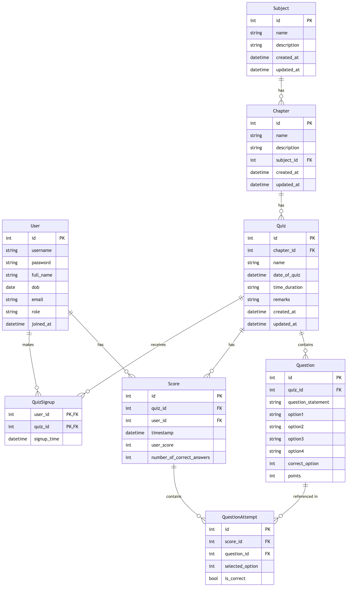

# Quiz Master Application: MAD-2 Project

### Author

- Name: Amit Vikram Raj
- Roll Number: 21f3002226
- Email: 21f3002226@ds.study.iitm.ac.in

### Description

This project implements a Quiz Master application that enables administrators to create subjects, chapters, and quizzes, while allowing users to register, take quizzes, and explore quizzes with authentication, authorization, and role-based access controls.

[Demo Video](link)

### Technologies used

- **Backend**: Python with Flask framework
- **Database**: SQLAlchemy ORM with SQLite database
- **Authentication**: JWT-based token authentication
- **API Documentation**: OpenAPI/Swagger specification
- **Frontend**: HTML, CSS, JavaScript with Bootstrap framework

### DB Schema Design

The database design follows a hierarchical structure with 8 main tables:

- **Users**: Stores user information with role-based permissions (admin/user)
- **Subjects**: Contains academic subjects created by administrators
- **Chapters**: Represents chapters within subjects
- **Quizzes**: Contains quiz details, linked to specific chapters
- **Questions**: Stores MCQs with options and correct answers
- **Scores**: Records user performance in quizzes
- **QuizSignups**: Tracks user registrations for upcoming quizzes (many-to-many)
- **QuestionAttempts**: Records individual question responses by users

The design enables efficient querying of quiz results, chapter relationships, and user performance statistics. Foreign key constraints and indexing optimize database performance while maintaining data integrity.

### API Design

The API provides complete functionality for quiz management and user interaction through RESTful endpoints:

1. **Authentication & Authorization**: JWT-based login/registration with role verification
2. **Admin Management**: User management capabilities for administrators
3. **Subject Management**: CRUD operations for subjects with search functionality
4. **Chapter Management**: Operations for creating and managing chapters within subjects
5. **Quiz Management**: Quiz creation, scheduling, and modification
6. **Question Management**: MCQ creation and management within quizzes
7. **Quiz Attempts & Scoring**: Endpoints for quiz taking, submission, and result viewing

API endpoints follow RESTful design principles with proper status codes, validation, and error handling.

### Architecture and Features

The project follows a clean architecture pattern with:

- **Controllers**: Located in route modules, handle HTTP requests and responses
- **Models**: Database models using SQLAlchemy ORM in the models directory
- **Config**: Environment-specific configuration in separate modules
- **Frontend**: The frontend is decoupled from the backend and interacts with backend via API calls
  