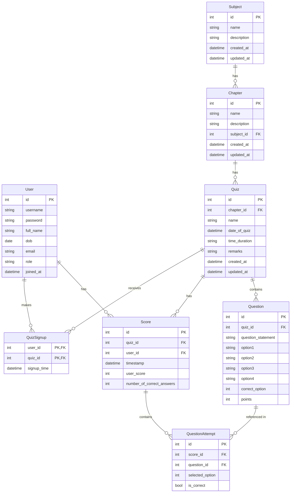

# Quiz API

## Setup

1. `cd quiz-api`
2. Create a `.env` file based on `.env.example`
3. Create a virtual environment and install the dependencies

    ```bash
    uv sync

    # OR
    python -m venv .venv
    source .venv/bin/activate
    make install
    ```
4. Run the app

    ```bash
    make run
    ```

## DB Schema Design



## TODO

- [ ] **TESTs** are out of sync with the code. Update the tests and add tests for new endpoints
- [ ] Update Pydantic Schemas
- [ ] Update OpenAPI schema and docs
- [ ] Dockerize the app
- [ ] Find a better way to handle configs, `config.py` and environment variables in `.env` file
- [ ] Better error handling and logging


## Other Tools Used

### Convert Mermaid to Image

```bash
# Install mermaid.cli
npm install -g @mermaid-js/mermaid-cli

# Convert to PNG
mmdc -i README.md -o db-schema.png --scale 3 # Use scale for higher DPI

# OR Use npx without installing globally
npx mmdc -i db-schema.mmd -o db-schema.svg  # Use SVG
```


### Convert README to PDF

```bash
# Install pandoc
brew install pandoc

# For macOS
brew install basictex

# Convert to PDF
pandoc README.md -o README.pdf
pandoc README.md -o README.pdf -V pagestyle=empty # Remove page numbers
pandoc README.md -o README.pdf -V pagestyle=empty -V geometry:margin=1in # Set margin
```